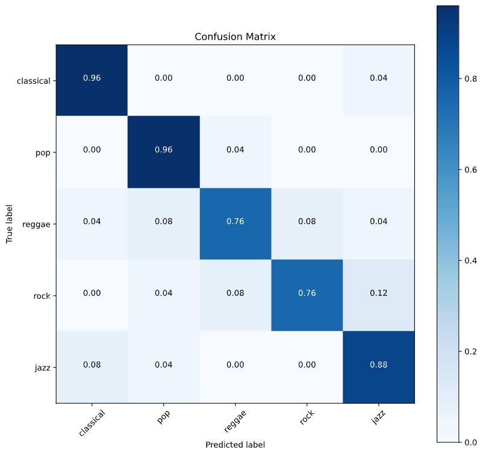

# MusicalTree
This is the repository for our CPAC project. 
Some demo video can be found at this links: 
-Time lapse demonstration --> https://youtu.be/7pRX-LU2cJ0
-Tree attraction points positions--> https://www.youtube.com/watch?v=3loV4kvBc7I

## Abstract:
The Musical Tree is a 3D music visualizer that can adapt itself depending on the musical genre to which it is exposed.
It is composed by a tree that grows “following” the music and by other interactive elements. 

## Music Genre Classification:
We implemented a machine learning based algorithm to perform the genre classification. The feature extraction process is applied to the GTZAN dataset in order to discriminate five music genres: 'Classical', 'Pop', 'Reggae', 'Rock', 'Jazz'. Each song in the database was stored as a 22050 [Hz], 16bits, and mono audio file.

### Feature Extraction Process:
Different kind of *low-level* and *high level* audio features are computed. They are categorized into rhythmic, spectral and tonal. They are decomposed into low-level and high-level according to the frame size: low-level features are extracted from a short window (1024 samples, 44.45 [ms] of duration) while high-level features are extracted from longer windows to gain a better frequency resolution (4096 samples, 186 [ms]), the first with 50% of overlap between successive windows, the second with 75%.
The different frame-based features are computed and then integrated over the all audio extract duration by means of the different **statistical moments** like *maximum* value, *minimum* value, *mean*, *standard deviation*, *skewness* and *kurtosis*.

### Splitting the data into Training Set and Test Set:
Here we build the sets `X_train` and `y_train` which are the training set of features and their corresponding set of labels, and the sets `X_test` and `y_test` which are the testing set of features. 

### SVM: Classification Model
The classification model is built up using Support Vector Machine available in the library '`sklearn`'.

### Model Training:
The training is done using `GridSearchCV` which exhaustively considers all parameter combinations identifying the one that maximizes the '`accuracy`'.

### Model Testing and Accuracy Evaluation:
The model is evaluated on the test set extracted at the beginning from the feature dataset in performing class prediction on newly unseen data.
Here we report the obtained confusion matrix.

  

### Recording and Communication with Processing
The application makes a recording with a duration of 1 second every second of music.
After the recording the code extracts the features on the recorded signal and predicts the genre. Finally the labelled genre is sent to processing via OSC messages.

## Visualization with Processing
The implementation can be divided in three parts:
  - elaboration of the audio input
  - graphical components
  - comunication from Python to Processing
### Audio
Starting from the “Audio analysis for pitch extraction” made by L. Anton-Canalis (https://gist.github.com/uberjosh/5001856#file-gistfile1-txt) that uses Minim library.
This code was rearranged to our purposes and extract some useful parameters:
 -	Spectrum (accurate only for frequency >200Hz and <10kHz)
 -	first 10 high intensity harmonics (frequency and amplitude)
 -	total amplitude of the signal
 -	energy of the signal
Each one of these parameters is also stored in a buffer that allow to calculate:
 -	mean intensity level
 -	mean spectrum

It is also possible to correct the implementation by uncomment the approximated phone curve
### graphical components
The graphical component can be devided in two time-dependent macro classes:
 - instantaneous reactive components
 - stored datas component: tree.
#### Color selection
Colors and sounds are associated by the superposition of the color chromatic wheel and the music chromatic wheel.
The light intensity is associated to the intensity of the sound.
This synaesthetics choices are very common in classical music since the 700’.

### Tree
The main component is the tree, starting from the "3D fractal tree"(https://www.youtube.com/watch?v=JcopTKXt8L8) was created some functions that make tree interact with the stored sound datas.
Tree grows trhought points that are calculated and stored during all the time.
The points coordinates are stored every 0.8s.
The location of the points is determined from attraction points that are computated, starting from the audio datas, in polar coordinates. 
So knowing the attraction point coordinates, a branch grows from the minimun distance between the existing branches and the attraction point.
There are also some condition that decide where put new branches points, like mass equilibrium condition.
To implement this condition, evry branch has a weight, a mass that is calculated depending from the distance of the branch to the starting tree point, and the "age" of the branch.
To each young and light branch can grow a leaf, normally to its direction, that is made by Bezier curves.
#### How is calculated attraction point position?
This position depends from the mean of the position calculated for each harmonic that is listened in the previous 0.8s.
The position of a pure sine sound is defined in polar coordinates where:
 - azimuth divided in 12 sectors = musical notes
 - height depends directly from the octave (or the frequency as the same)
 - radial distance depends directly from the amplitude
(Demo video https://youtu.be/3loV4kvBc7I )

### Istantaneous reactive components
#### Envirorment
The environment is made of a sphere, that is the planet on which the tree grows.
At a distance Z over the planet is located a light that has the color of the sum of the sounds colors. Its intensity depends from the sound intensity.
A bolt starts from the light computed point and falls on the planet when the sound level is around the peak. Its color is related to the highest sound.
#### Genre dependent components
##### Classica
  - 7 columns around the tree that represents the notes. They shake when the level is around the peak
  - a light illuminates the column of the highest note proportionally to the intensity of sound
  - sun that is computed like waveshape in 2 dimensions
##### Reggae
  - setting sun that is computed like waveshape in 2 dimensions
“typical” leaves that navigate in the sky
  - background and tree leaves are colored in green, yellow and red
##### Pop
  - Flash when level is very high
  - Color mixed points cloud that expands proportionally to the sound level 
##### Rock
  - Flash with rock hands on the background
  - planet that change radius as sound level
##### Jazz
  - Stars that moves simulating a real sky
  - saxophone and piano that moves as the sound level
  - star fountain that come out from the sax when mean level is high
  - light in piano of the color of the strongest note
### Other things
pressing:
  - UP -> amplification level goes up
  - DOWN -> amplification level goes down
  - ENTER -> print amplification level
  - ALT -> reset datas store of the tree
  - SHIFT -> change visualization from fixed to navigable 3D

Developed by Gioele Greco, Tommaso Botti and Nicolò Botti.
